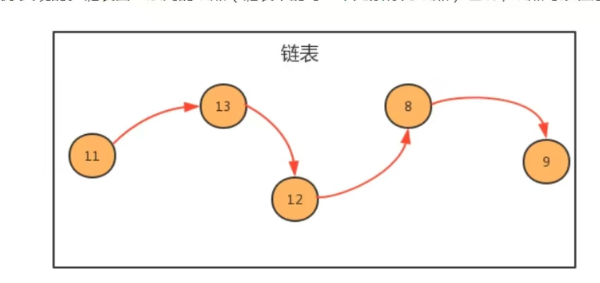
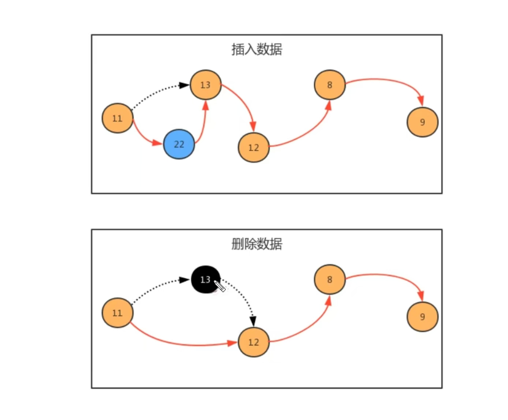

# 一、线性表

## 1.1 顺序表

### 1.1.1 顺序表的实现

顺序表（Sequence List）是一种使用数组实现的线性表，元素在内存中连续存储。

**顺序表的特点：**

- 元素在内存中连续存储
- 支持随机访问，通过索引直接访问元素
- 插入和删除操作需要移动元素
- 需要预先分配固定大小的存储空间

**顺序表的基本操作：**

| 类名 | SequenceList< t> |
|------|-----------------|
|成员方法|1.public void clear():空置线性表   <br/>2.publicboolean isEmpty():判断线性表是否为空<br/>3.public int length():获取线性表中元素的个数<br/>4.public T get(int i):读取并且返回线性表中第i元素的值<br/>5.public void insert(int i,T t)在线性表第i个元素前插入t<br/>6.public void insert(T,t):向线性表中添加一个元素t<br/>7.public T remove(int i):删除并返回线性表中第i个元素<br/>8.public int indexOf(T t):返回线性表中首次出现t的位置，若不存在返回-1|
|成员变量|1.private T[] eles:储存元素的数组<br/>2.private int N:当前线性表的长度|

```java
public class SequeceList<T>{
    priavte T[] eles;
    private int N;
    public SequenceList(int capacity){
        this.eles = (T[])new Object[capacity];
        this.N = 0;
        };
    public void clear(){
        this.N = 0;
    }
    public boolean isEmpty(){
        return N == 0;
    }
    public int length(){
        return N;
    }
    public T get(int i){
        return eles[i];
    }
    public void insert(T t){
        eles[N++] = t;
    }
    public void insert(int i,T t){
        for(int j = N,j>i,j--){
            eles[j] = eles[j-1];
        }
        eles[i] = t;
    }
    public T remove(int i){
        T current = eles[i];
        for(int index = i;index<N-1;index--){
            eles[index] = eles[index+1];
        }
        N--;
        return current;
    }
    public int indexOf(T t){
        for(int i = 0;i<N;i++){
            if(eles[i].equals(t)){
                return i;
            }
        }
        return -1;
    }
}
```

ps：测试代码于SequenceListTest.java
### 1.1.2顺序表的扩容

**顺序表的扩容和删容：**

resize 重新制定数组大小：
```java
public void resize(int newSize)
T[] temp = eles;
eles = (T[])new Object[newSize];
for(int i = 0;i<N;i++){
    eles[i] = temp[i];
}
```
在insert中使用resize进行扩容：
```java
public void insert(T t){
    if(N == eles.length){
        resize(2*eles.length);
    }
    eles[N++] = t;
}
```
在remove中对数组进行减容：
```java
public T remove(int i){
        T current = eles[i];
        for(int index = i;index<N-1;index++){
            eles[index] = eles[index+1];
        }
        N--;
        if(N<eles.length/4){
            resize(eles.length/2);
        }
        return current;
    }
```

### 1.1.3顺序表的遍历

**重写遍历的作用**

- 统一接口：与其他java集合（arraylist，likedlist）用法一致
- 代码简洁
- 避免错误
没有遍历的情况
```java
实现前（不支持foreach）：
// 编译错误！SequenceList不支持foreach
for(String s : list) {  // ❌ 错误
    System.out.println(s);
}
```
```java
实现后（支持foreach）：
// 现在可以用了！
for(String s : list) {  // ✅ 正确
    System.out.println(s);
}
```
写法：
```java

@Override
public Iterator<T> iterator(){
    return new SIterator();
}
    
private class SIterator implements Iterator<T>{
        private int cursor;
        public SIterator(){
            this.cursor = 0;
        }
        @Override
        public boolean hasNext(){
            return cursor < N;
        }
        @Override
        public T next(){
            return eles[cursor++];
        }
    }
```
实现了Iterable接口的SequenceList泛型类:
```java
public class SequenceList<T> implements Iterable<T>
```
### 1.1.4ArrayList实现


## 1.2链表

**理解链表**



**链表的意义**
- 在顺序表中，查询很快，时间复杂度为O（1），但是删增的效率低为O（n）
- 因为每一次删增都会伴随着大量数据元素的移动
- 链表是一种物理存储单元上非连续非顺序的存储结构
- 链表中的数据元素的逻辑顺序是通过链表中的指针链接次序实现的（结点）

**链表结点的设计**
|类名|```Node<T>```|
|----|------------|
|构造方法|```Node(T,t,Node next):创建Node对象```|
|成员变量|T item:创建Node对象<br/>Node next：指向下一个结点|

**结点的实现**
```java
public class Node<T>{
    public T item;
    public Node next;
    public Node(T item,Node next){
        this.item = item;
        this.next = next;
    }
}
```

**生成链表** 
```java
public static void main(String[] args)throws Exception{
    //构建结点
    Node<Interger> first = new Node<Interger>(11,null);
    Node<Interger> second = new Node<Interger>(13,null);
    Node<Interger> third = new Node<Interger>(12,null);
    //生成链表
    first.next = second;
    second.next = third;
}
```

### 1.2.1单向链表

单向链表是链表的一种，由多个结点组成，每一个结点都有一个数据域和一个指针域组成

#### 1.2.1.1
**单向链表API设计**
|类名|LinkList&lt;T&gt;|
|---|------------------|
|构造方法|LinkList（）：创建LinkList对象|
|成员方法|1.public void clear():空置线性表   <br/>2.publicboolean isEmpty():判断线性表是否为空<br/>3.public int length():获取线性表中元素的个数<br/>4.public T get(int i):读取并且返回线性表中第i元素的值<br/>5.public void insert(int i,T t)在线性表第i个元素前插入t<br/>6.public void insert(T,t):向线性表中添加一个元素t<br/>7.public T remove(int i):删除并返回线性表中第i个元素<br/>8.public int indexOf(T t):返回线性表中首次出现t的位置，若不存在返回-1|
|成员内部类|private class Node&lt;T&gt;：结点类|
|成员变量|1.private class Node&lt;T&gt;:记录首结点<br/>2.private int N:记录链表的长度|

```java
package 线性表;

public class LinkList<T> {
    private Node head;
    private int N;
    private class Node{
        T item;
        Node next;
        public Node(T item,Node next){
            this.item = item;
            this.next = next;
        }
        }
    public LinkList(){
        this.head = new Node(null,null);
        this.N = 0;
    }
    public int length(){
        return N;
    }
    public boolean isEmpty(){
        return N==0;
    }
    public T get(int i){
        Node n = head.next;
        for(int index = 0;index<i;i++){
            n = n.next;
        }
        return n.item;
    }
    public void insert(T t){
        Node n = head;
        while(n.next!=null){
            n = n.next;
        }
        Node newNode = new Node(t,null);
        n.next = newNode;
        N++;
    }
    public void insert(int i,T t){
        //找到i位置前一个结点
        Node pre = head;
        for(int index = 0;index<i;i++){
            pre = pre.next;
        }
        //找到i位置的结点
        Node curr = pre.next;
        //创建新结点，并且新结点需要指向原来i位置的结点
        Node newNode = new Node(t,curr);
        //原来i位置的结点指向新结点即可
        pre.next = newNode;
        N++;
    }
    public T remove(int i){
        //要找到i位置的前一个结点
        Node pre = head;
        for(int index = 0;index<i;i++){
            pre = pre.next;
        }
        //要找到i位置的结点
        Node curr = pre.next;
        //要找到i位置下一个结点
        Node nex = curr.next;
        //前一个结点指向下一个结点
        pre.next = nex;
        //元素个数-1
        N--;
        return curr.item;
    }
    public int indexOf(T t){
        Node n = head;
        for(int index = 0;n.next!=null;index++){
            n = n.next;
            if(n.item.equals(t)){
                return index;
            }
            
        }
        return -1;
    }
}
```
### 1.2.2双向链表
#### 1.2.2.1
双向链表由多个结点构成，每个结点由一个数据域和两个指针域组成，一个指针指向后继结点，另一个指向前驱结点
|类名|Node```<T>```|
|---|----|
|构造方法|Node（T t，Node pre，Node next）：创建Node对象|
|成员变量|T item存储数据<br/>Node next:指向下一个结点<br/>Node pre:指向上一个结点|
#### 1.2.2.2
双向链表的API设计
|类名|TowWayLinkList```<T>```|
|---|------|
|构造方法|TowWayLinkList（）：创建TowWayLinkList对象|
|成员方法|1.public void clear():空置线性表   <br/>2.publicboolean isEmpty():判断线性表是否为空<br/>3.public int length():获取线性表中元素的个数<br/>4.public T get(int i):读取并且返回线性表中第i元素的值<br/>5.public void insert(int i,T t)在线性表第i个元素前插入t<br/>6.public void insert(T,t):向线性表中添加一个元素t<br/>7.public T remove(int i):删除并返回线性表中第i个元素<br/>8.public int indexOf(T t):返回线性表中首次出现t的位置，若不存在返回-1<br/>9.public T geiFirst():获取第一个元素<br/>10.public T getSecond()获取最后一个元素|
|成员内部类|private class Node```<T>```:结点类|
|成员变量|1.private Node first:记录首结点<br/>2.private Node last:记录尾结点<br/>3.private int N:记录链表长度|
